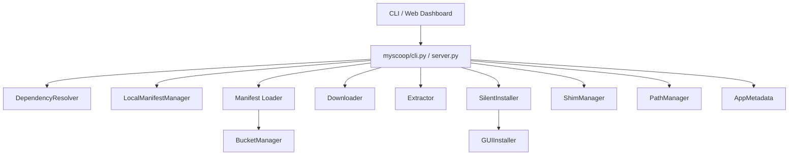
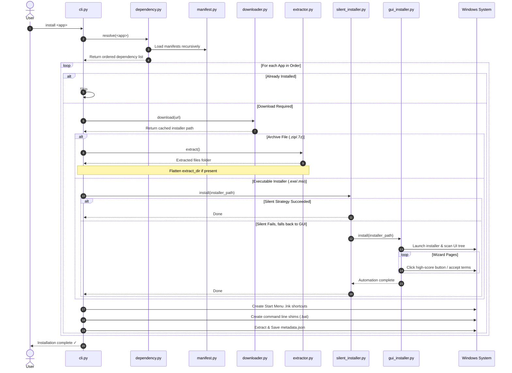

# MyScoop Package Manager: Complete System Architecture & Details

MyScoop is a Python-based custom package manager designed for Windows. Inspired by the command-line utility [Scoop](https://scoop.sh/), MyScoop extends traditional package management functionality by implementing a **silent-first cascade installation flow**, an **adaptive GUI automation engine** to handle interactive wizards, **privilege-free environment variable updates**, and a **FastAPI web dashboard** with real-time log streaming.

---

## Table of Contents
1. [System Overview & Architecture](#1-system-overview-architecture)
2. [Module Specifications](#2-module-specifications)
3. [Core Workflow Pipelines](#3-core-workflow-pipelines)
4. [Windows Integration & System APIs](#4-windows-integration--system-apis)
5. [FastAPI Dashboard & Live Logging](#5-fastapi-dashboard--live-logging)
6. [Predefined Manifest System](#6-predefined-manifest-system)
7. [CLI Reference Manual](#7-cli-reference-manual)
8. [External Dependencies](#8-external-dependencies)

---

## 1. System Overview & Architecture

MyScoop is structured as a modular library under the `myscoop` package, managed by a CLI wrapper (`myscoop.py` / `myscoop/cli.py`) and a web API manager (`server.py`). 



### Core Design Philosophy
* **User-Level Execution**: Operates entirely within the user's home folder (`~/myscoop`) and edits user-level registries. No Administrator/UAC elevation is required for standard operations.
* **Portable Flat Structures**: Applications are installed in isolated version-specific directories (`~/myscoop/apps/<app-name>/<version>`).
* **Environment Cleanliness**: Executables are exposed via lightweight forwarders (shims) in a single directory (`~/myscoop/shims`) rather than appending individual app folders to the user `PATH`.
* **Robust Automation Fallback**: If standard installer silent switches fail or are unavailable, MyScoop automatically falls back to driving the graphical wizard window through OS-level click and field interactions.

---

## 2. Module Specifications

Each python module within the [myscoop](file:///c:/Users/astha/Downloads/MakingScoopBinary-main/MakingScoopBinary-main/myscoop/) package has a dedicated responsibility:

### 2.1 Manifest Loader & Parser (`myscoop/manifest.py`)
Responsible for locating, loading, and parsing application JSON manifests.
* **Lookup Strategy**: Walks all immediate subdirectories of the bucket folder (e.g. `main/`, `extras/`) and searches for `<app_name>.json` case-insensitively. Supports standard flat layouts as well as nested `/bucket` layouts.
* **Architecture Selection**: Detects host architecture via `platform.machine()`. Prioritizes the `64bit` block on 64-bit operating systems, falling back to `32bit` or top-level configurations.
* **URL Hint Parsing**: Detects if a URL has an attached extraction target (e.g. `Installer.exe#/dl.7z`). Separates the clean URL from the `#` metadata fragment.

### 2.2 File Downloader (`myscoop/downloader.py`)
Manages local file downloads using the `requests` library and caches files inside `~/myscoop/cache`.
* **Caching Strategy**: Saves files in the format `cache_dir/<app_name>-<version>-<original_filename>`. Checks if a file exists and has size > 0 to skip repeated downloads.
* **Terminal Interface**: Implements a `tqdm` progress bar with byte scaling and connections with up to 30-second timeouts.
* **Atomic Writes**: Writes downloads to a temporary `.downloading` file, which is renamed to the final cache path only on complete success.

### 2.3 Archive & Installer Extractor (`myscoop/extractor.py`)
Handles target archive decompression and folder structural cleanup.
* **Extraction Formats**:
  * **ZIP**: Extracted natively via Python's `zipfile` module.
  * **7Z**: Attempts pure Python extraction via `py7zr`, falling back to the system's `7z.exe` if available.
  * **MSI**: Administers clean unpacked extraction via command execution: `msiexec /a <filepath> /qn TARGETDIR=<dest_dir>`.
* **Squirrel/NuGet Handling**: Detects Electron/Squirrel scaffolding files (like `<app>-full.nupkg`). If present, it opens the `.nupkg` archive, extracts all files from its inner `lib/net*/` folders to the app's root, and cleans up the Squirrel files.
* **Folder Flattening**: If a manifest specifies `extract_dir`, the extractor relocates all files from `app_dir/extract_dir/*` to `app_dir/*` and removes the empty subfolder.

### 2.4 Silent Installer (`myscoop/silent_installer.py`)
Implements a cascade of execution strategies to install applications silently.
* **Cascade Ordering**:
  1. Explicit Manifest Configuration (e.g. Type `7z`, `msi`, `nsis`, `inno`, `gui`).
  2. MSI silent install (`/qn TARGETDIR=`).
  3. NSIS silent install (`/S /D=`).
  4. Inno Setup silent install (`/VERYSILENT /SUPPRESSMSGBOXES /DIR=`).
  5. Archive extraction (for self-extracting executables).
  6. GUI automation fallback.
* **UAC Bypass Heuristic**: Adds `__COMPAT_LAYER=RunAsInvoker` to the sub-process environment to bypass requests for Administrator privileges unless hard-coded by the installer.
* **Interactive Window Detection**: During supposed silent installations, it uses Windows Win32 APIs to check if the installer process tree spawned any visible window containing setup-wizard keywords. If an interactive window is detected, the silent installer terminates the process tree immediately and moves to the next cascade step.

### 2.5 GUI Automation Engine (`myscoop/gui_installer.py`)
An adaptive script designed to drive interactive Windows installation wizards to completion.
* **UI Tree Scanning**: Uses the UIA backend via `pywinauto` to read controls (buttons, links, check boxes, radio buttons).
* **Win32 Enum Fallback**: Uses standard Windows handle enumerations to read controls when the UIA framework fails.
* **Image Recognition Fallback**: Uses `pyautogui` and `Pillow` (PIL) to search for and click button shapes on screen for custom-drawn frameworks.
* **Decision-Making Matrix**: Employs a scoring algorithm (`BUTTON_PRIORITY`) to select which button to click.
  * *Finish/Done*: score 100
  * *Install/Start*: score 85
  * *Next/Continue*: score 70
  * *I Accept (License)*: score 65
  * *Cancel/Back/Remove*: Ignored / Score 0
* **Smart Actions**: Automatically checks license checkboxes and unchecks "Launch Application on Finish" checkboxes to ensure a clean background installation.
* **Change Snapshotting**: Snapshots directory files before and after installation to accurately record installed binaries.

### 2.6 Command Shim Generator (`myscoop/shim.py`)
Exposes installed applications to the terminal without cluttering the global system configuration.
* **Shim Generation**: Creates lightweight `.bat` batch files in the `~/myscoop/shims` folder.
* **GUI vs. CLI Forwarding**:
  * **CLI**: Normal batch forwarding: `@"C:\path\to\app.exe" %*`.
  * **GUI**: Launches the application asynchronously: `@start "" /b "C:\path\to\app.exe" %*`. This ensures the terminal returns control to the user immediately and does not flash a terminal window.

### 2.7 Environment PATH Manager (`myscoop/path_manager.py`)
Adds the `shims` folder to the environment search path.
* **Privilege-Free Modification**: Read and writes from the user registry: `HKEY_CURRENT_USER\Environment` (Path value). Never touches system folders or requires admin rights.
* **Immediate Application**: Broadcasts a `WM_SETTINGCHANGE` system message using the Win32 `SendMessageTimeoutW` API. This triggers running applications and new terminals to reload environment variables instantly.

### 2.8 Dependency Resolver (`myscoop/dependency.py`)
Resolves prerequisites for applications based on manifest declarations.
* **Order Calculation**: Uses a depth-first search (DFS) algorithm to sort dependencies, ensuring libraries are installed before parent programs.
* **Cycle Protection**: Tracks active visits in a stack to detect circular loops and raise a `CircularDependencyError`.
* **Installed Check**: Checks if an application directory exists in `~/myscoop/apps` and has at least one version subdirectory containing files.

### 2.9 Bucket Manager (`myscoop/bucket.py`)
Manages repositories of app manifests.
* **Git Operations**: Uses `GitPython` to clone (`depth=1` shallow clone) and pull updates from remote repositories.
* **Search Engine**: Scans bucket directories, reads manifest JSON files, and matches the query against application names and description strings.

### 2.10 Metadata Extractor (`myscoop/metadata.py`)
Gathers detailed metrics from installed binaries.
* **Win32 Details**: Uses `pywin32` APIs (`GetFileVersionInfo`) to extract File Version, File Description, and Manufacturer name.
* **File properties**: Computes filesize, human-readable file formats, and CRC32 checksums.
* **Executable Resolver**: Locates the true application executable by checking manifest bin variables, resolving shortcut `.lnk` targets, or scoring directory binaries based on depth and filename match.

### 2.11 Local Manifest Generator (`myscoop/local_manifest.py`)
Allows users to install raw installer executables or archives directly.
* **Manifest Matching**: Searches remote bucket URL lists to see if the local file matches the filename of a known online application. If a match is found, it reuses that manifest.
* **Auto-Generation**: If the file is unknown, it extracts file properties, parses versioning info from the file name, determines the installer format, and writes a temporary manifest under `buckets/main/<normalized-name>.json` pointing to the file's local URI.

## 3. Core Workflow Pipelines

### 3.1 The Complete Installation Sequence


---

## 4. Windows Integration & System APIs

MyScoop relies heavily on direct interactions with the Windows OS. The following techniques are used:

| Functionality | API / Library | Details | Code Location |
| :--- | :--- | :--- | :--- |
| **User PATH Update** | `winreg` (Registry) | Reads and updates key `HKCU\Environment\Path` to avoid requiring admin rights. | `path_manager.py` |
| **Broadcast PATH Changes** | `ctypes.windll.user32` | Calls `SendMessageTimeoutW` with `WM_SETTINGCHANGE` to notify active shells. | `path_manager.py` |
| **LNK Shortcut Target Resolution** | `win32com.client` | Spawns `WScript.Shell` to read properties of `.lnk` shortcut targets. | `metadata.py` |
| **LNK Shortcut Creation** | `powershell` | Spawns a PowerShell sub-process executing `New-Object -ComObject WScript.Shell` to write Start Menu shortcuts. | `cli.py` |
| **File Metadata Extraction** | `win32api` | Calls `GetFileVersionInfo` and parses language/codepage `StringFileInfo` headers. | `metadata.py` |
| **Active Installer Detection** | `ctypes.windll.user32` | Uses `EnumWindows` and `GetWindowTextW` callbacks to inspect open window frames. | `silent_installer.py` / `gui_installer.py` |
| **Process Tree Monitoring** | `psutil` | Traverses child processes recursively to identify processes spawned by bootstrapping installers. | `silent_installer.py` / `gui_installer.py` |
| **UAC Compatibility** | `subprocess.Popen` | Sets `__COMPAT_LAYER=RunAsInvoker` in environmental variables to suppress admin prompts during silent installer attempts. | `silent_installer.py` |

---

## 5. FastAPI Dashboard & Live Logging

The dashboard consists of a backend web server (`server.py`) and a single-page HTML frontend (`static/`).

### 5.1 Web API Endpoints
* **`GET /`**: Serves the user dashboard index.
* **`GET /api/apps`**: Scans the `~/myscoop/apps` directory and returns a JSON list of installed applications and their latest versions.
* **`POST /api/install`**: Starts an installation job in a background thread. Accepts a JSON payload containing `path` (can be an absolute path to a single `.exe`/`.msi`/`.zip`/`.7z` file or a directory containing multiple installers).
* **`GET /api/install/status`**: A Server-Sent Events (SSE) stream. Broadcasts active installation and extraction logs live to the browser interface.

### 5.2 Thread-Safe Stream Redirector
To capture output from `click.echo` and terminal prints within the engine, `server.py` overrides `sys.stdout` with a custom `StreamLogger` proxy:
1. Filters out ANSI color sequences using regular expressions: `r'\x1B(?:[@-Z\\-_]|\[[0-?]*[ -/]*[@-~])'`.
2. Encodes streams to UTF-8 dynamically.
3. Broadcasts clean text messages to all active browser SSE queues using thread-safe locking structures (`threading.Lock`).

---

## 6. Predefined Manifest System

Applications are defined using JSON manifest files stored in buckets. A manifest defines installation and update rules.

### Schema Properties

```json
{
  "name": "App Identifier (lowercase)",
  "version": "1.0.0",
  "description": "App description",
  "homepage": "https://example.com",
  "license": "License name or JSON descriptor",
  "depends": ["dep-app-1", "dep-app-2"],
  "architecture": {
    "64bit": {
      "url": "Download URL",
      "extract_dir": "Sub-folder to unpack"
    },
    "32bit": {
      "url": "Download URL"
    }
  },
  "bin": [
    "RelativePath/app.exe"
  ],
  "shortcuts": [
    [
      "RelativePath/app.exe",
      "Start Menu Shortcut Name"
    ]
  ],
  "installer": {
    "type": "gui / msi / nsis / inno / 7z",
    "gui_exe": "Path/to/wizard.exe",
    "args": ["/optional-switch"]
  },
  "post_install": [
    "echo Run command after install"
  ]
}
```

---

## 7. CLI Reference Manual

MyScoop includes a comprehensive command-line interface:

* **Install an app**: 
  ```bash
  python myscoop.py install <app-name>
  ```
* **Install via local file** (skips download):
  ```bash
  python myscoop.py install --file <path-to-installer> <app-name>
  # OR directly pass path:
  python myscoop.py install <path-to-installer>
  ```
* **Update an app**:
  ```bash
  python myscoop.py update <app-name>
  ```
* **List installed apps**:
  ```bash
  python myscoop.py list
  ```
* **Search for apps**:
  ```bash
  python myscoop.py search <query>
  ```
* **Show app information**:
  ```bash
  python myscoop.py info <app-name>
  ```
* **Show dependency tree**:
  ```bash
  python myscoop.py depends <app-name>
  ```
* **Show metadata for installed app**:
  ```bash
  python myscoop.py metadata <app-name>
  ```
* **Add a bucket repository**:
  ```bash
  python myscoop.py bucket add <name> <git-url>
  ```
* **List active buckets**:
  ```bash
  python myscoop.py bucket list
  ```
* **Update all buckets**:
  ```bash
  python myscoop.py bucket update
  ```
* **Remove a bucket**:
  ```bash
  python myscoop.py bucket rm <name>
  ```
* **Remove cached installer file**:
  ```bash
  python myscoop.py cache rm <app-name>
  ```

---

## 8. External Dependencies

All third-party libraries required by MyScoop are listed in [requirements.txt](file:///c:/Users/astha/Downloads/MakingScoopBinary-main/MakingScoopBinary-main/requirements.txt):

* **`click`**: CLI framework.
* **`requests`**: Downloading installers.
* **`tqdm`**: Terminal progress bars.
* **`py7zr`**: Native 7z extraction.
* **`colorama`**: Colored terminal log outputs.
* **`gitpython`**: Cloning and updating bucket repositories.
* **`pywin32`**: Accessing Windows registry keys and parsing file versions.
* **`pywinauto`**: Controlling and driving setup wizards.
* **`pyautogui`**: Fallback mouse and button click simulator.
* **`psutil`**: Inspecting running installer process trees.
* **`fastapi`**: Hosting API backends.
* **`uvicorn`**: WSGI/ASGI web server runner.
